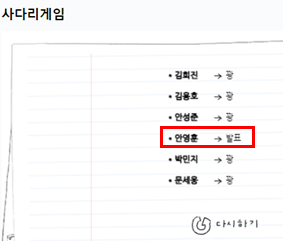

## 머신러닝 프로젝트
---
주제 : 머시러닝 기반 00000
---
### 프로젝트 개요
- 그림추가

### 프로젝트 기간

### 참여자
- 리더 
- 팀원1
- 팀원1
- 팀원1

## 발표자

## 주제 선정
1. 서울시 부동산 실거래가 예측 
  - https://github.com/fkxowls2/Seoul-Real-Estate-Analysis/blob/main/서울시%20부동산%20실거래%20분석%20및%20예측.ipynb

2.음식 추천 서비스
  - https://github.com/Team-Delight/Delight-MachineLearning-Application

3. 테니스 라켓
  - https://www.kaggle.com/leoyuanluo/tennis-racquets-specs?select=tennisRacquets.csv

4. 영화 관람

5. 넷플릭스 추천 알고리즘

6. 중고차 시세 
  - https://www.kaggle.com/iabhishekmaurya/used-car-price-prediction

7. 차 시세
  - https://www.kaggle.com/goyalshalini93/car-price-prediction-linear-regression-rfe

8. 야구
  - https://www.kaggle.com/wyattowalsh/basketball

9. NFL 헬멧 
  - https://www.kaggle.com/c/nfl-health-and-safety-helmet-assignment

10. 골프

그냥 차 - 김희진 , 안영훈, 박민지, 안성준

NFL 헬멧 - 김희진

야구 - 문세웅, 박민지, 안영훈, 김용호

넷플릭스 알고리즘 - 문세웅, 안성준, 김용호

**수정 날짜 210909 **

**작성자: 김용호**
